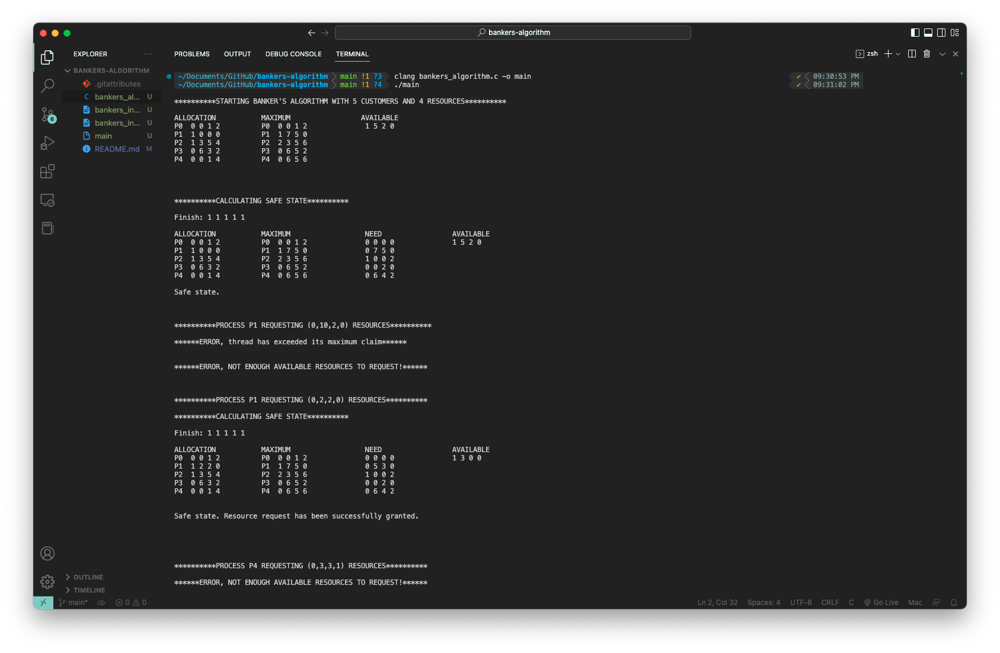

# bankers-algorithm
#### Project to implement the Banker's Algorithm resource allocation and deadlock avoidance algorithm in c language. Calculates resource requests and releases and shows safe states if granted.
#### To use, compile bankers_algorithm.c and run

 
